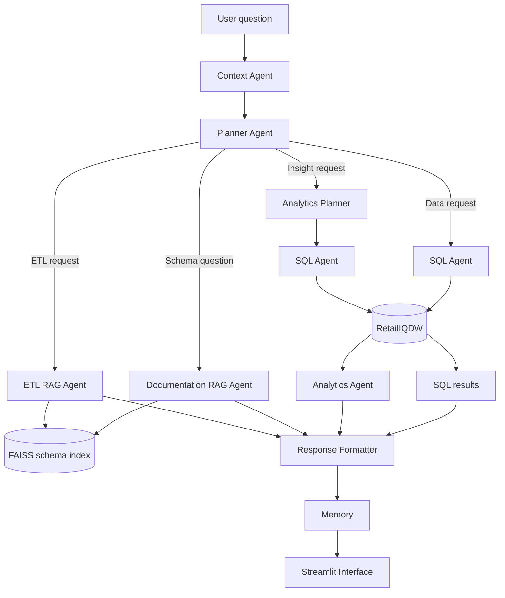
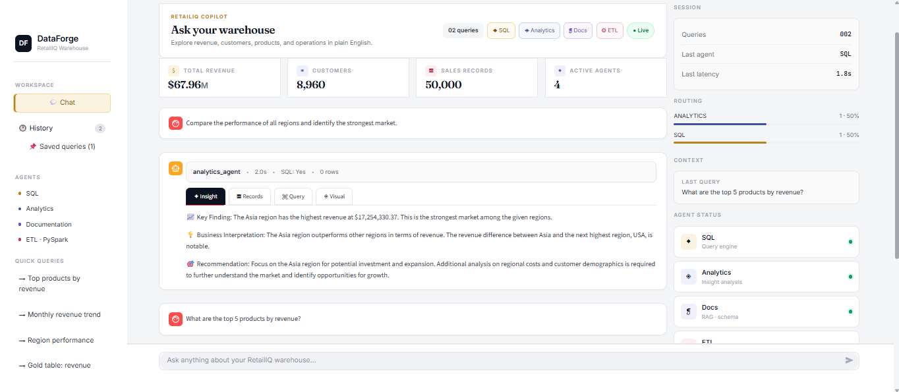
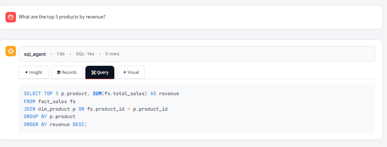
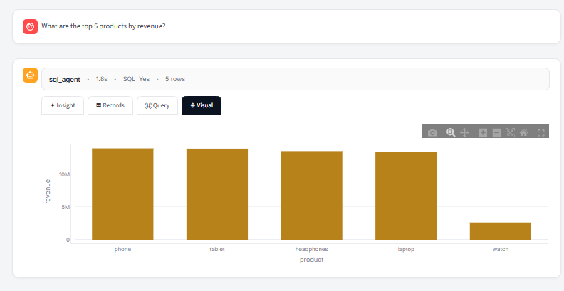
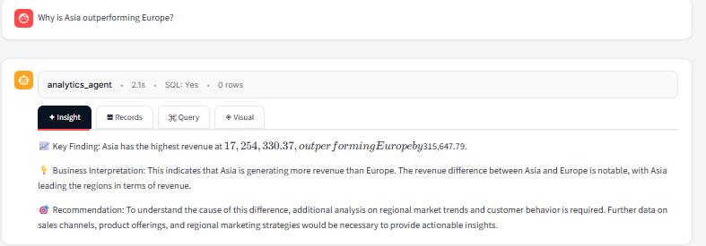
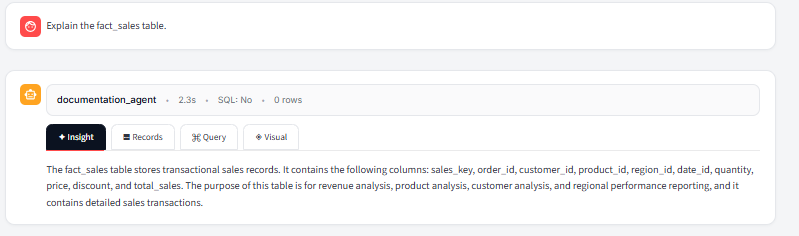
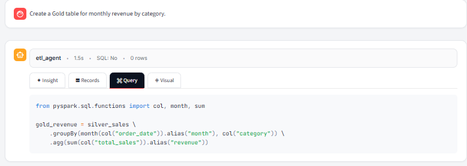
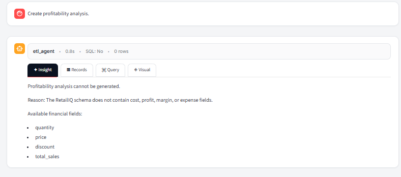

# DataForge AI
## Live Demo

Coming Soon (Streamlit Deployment)

## Architecture


Multi-Agent Analytics Copilot for Retail Data Warehouses

DataForge AI transforms natural-language business questions into:

- SQL queries
- Business insights
- Schema-aware documentation answers
- PySpark ETL transformations

Built using LangGraph, LangChain, Groq, FAISS, SQL Server, and Streamlit.

RetailIQ Warehouse → Multi-Agent Reasoning → Business Answers

[](https://www.python.org/)
[](https://www.langchain.com/langgraph)
[](https://streamlit.io/)
[](https://www.microsoft.com/sql-server)

## Overview

DataForge AI is the agentic intelligence layer built on top of the [RetailIQ Lakehouse](https://github.com/BHAVIKABADDUR/retail-intelligence-lakehouse). It routes each user request to a specialized agent, executes the appropriate workflow, and presents the result through a polished Streamlit interface.

The project demonstrates how data engineering, retrieval-augmented generation, natural-language SQL, business analytics, and workflow orchestration can be combined into one conversational data application.


## Project Metrics

- 50,000 retail transactions
- 4 specialized AI agents
- 5 warehouse tables
- FAISS-powered schema retrieval
- Microsoft SQL Server warehouse
- LangGraph workflow orchestration
- Streamlit enterprise analytics interface

## What It Can Do

- Convert natural-language questions into Microsoft SQL Server queries
- Execute generated SQL against the RetailIQ star schema
- Present query results as interactive records and visualizations
- Chain data retrieval with a business-analysis agent for insight questions
- Answer warehouse schema questions using FAISS-based RAG
- Generate schema-aware PySpark transformations for Silver and Gold layers
- Preserve single-turn conversational context for follow-up questions
- Route requests across agents using LangGraph
- Display agent metadata, generated queries, records, and visuals in Streamlit
- Save, rename, rerun, and delete reusable queries locally

## System Architecture



## Agent Responsibilities

| Agent | Responsibility |
|---|---|
| Context Agent | Classifies complete questions versus follow-ups and rewrites follow-ups as standalone requests |
| Planner Agent | Routes requests to SQL, analytics, documentation, or ETL workflows |
| SQL Agent | Generates SQL Server-compatible queries and retrieves warehouse data |
| Analytics Planner | Converts interpretation questions into the data request needed for analysis |
| Analytics Agent | Produces evidence-based business insights from retrieved results |
| Documentation RAG Agent | Answers table, column, and schema questions using retrieved documentation |
| ETL RAG Agent | Generates PySpark transformations using approved RetailIQ columns and business-rule guardrails |

## User Experience

The Streamlit application provides:

- A conversational warehouse interface
- KPI cards for RetailIQ metrics
- Agent routing and latency indicators
- Response tabs for **Insight**, **Records**, **Query**, and **Visual**
- Syntax-highlighted SQL and PySpark output
- Clickable starter prompts
- Saved-query management
- Loading, success, and confirmation feedback

## Demo

### Analytics Workflow Example

**User Question**

```text
Compare the performance of all regions and identify the strongest market.
```

**Workflow**

```text
Context Agent
        ↓
Planner Agent
        ↓
Analytics Planner
        ↓
SQL Agent
        ↓
Analytics Agent
        ↓
Business Insight
```

**Example Insight**

```text
The Asia region generated $17.25M in revenue,
making it the strongest performing market.

Asia outperformed the next highest region,
USA, by a significant margin.
```

This demonstrates how DataForge AI combines data retrieval, analytics reasoning, and agent orchestration to transform warehouse data into actionable business insights.

---

## Screenshots

### Enterprise Analytics Workspace

The main DataForge AI interface featuring KPI cards, agent status monitoring, query routing statistics, saved queries, and a conversational analytics workspace.



---

### SQL Agent — Natural Language to SQL

**User Question**

```text
What are the top 5 products by revenue?
```

Generated SQL query with execution metadata and returned records.



---

### SQL Agent — Interactive Visualization

The generated results are automatically visualized using interactive Plotly charts.



---

### Analytics Agent — Business Insights

**User Question**

```text
Compare the performance of all regions and identify the strongest market.
```

The Analytics Agent chains SQL retrieval with business reasoning to generate evidence-based insights and recommendations.



---

### Documentation RAG Agent

**User Question**

```text
Explain the fact_sales table.
```

Schema-aware answers are generated using Retrieval-Augmented Generation (RAG) over warehouse documentation.



---

### ETL RAG Agent — PySpark Generation

**User Question**

```text
Create a Gold table for monthly revenue by category.
```

The ETL Agent generates schema-aware PySpark transformations using only approved RetailIQ columns.



---

### ETL Guardrails

**User Question**

```text
Create profitability analysis.
```

The ETL Agent blocks unsupported requests when required business logic or schema fields do not exist in the warehouse schema.



---


## Technology Stack

| Area | Technologies |
|---|---|
| Language | Python |
| Agent orchestration | LangGraph, LangChain |
| LLM | Groq - Llama 3.3 70B Versatile |
| Data warehouse | Microsoft SQL Server, pyodbc |
| Retrieval | FAISS, Sentence Transformers |
| Data processing | Pandas, PySpark code generation |
| Interface | Streamlit, Plotly |
| Configuration | python-dotenv |

## RetailIQ Data Model

DataForge AI queries the warehouse created in Project 1:

```text
                      dim_customer
                            |
dim_product ----------- fact_sales ----------- dim_region
                            |
                         dim_date
```

The warehouse contains 50,000 synthetic retail transactions across products, customer segments, regions, and dates from 2023 to 2025.

## Example Questions

### SQL Analytics

```text
What are the top 5 products by revenue?
Show monthly revenue trends.
Compare revenue between Asia and Europe.
Which customer segment has the highest average order value?
```

### Business Insights

```text
Which region has the lowest performance and why?
What is driving the revenue gap between customer segments?
Which product category is underperforming?
```

### Schema Documentation

```text
Explain the fact_sales table.
What columns exist in dim_product?
What is the purpose of dim_date?
```

### ETL Generation

```text
Create a Gold table for monthly revenue by category.
Generate a PySpark customer-segmentation transformation.
Build a revenue-by-region aggregation from silver_sales.
```

## Project Structure

```text
dataforge-ai/
|-- agents/
|   |-- sql_agent.py
|   |-- planner_agent.py
|   |-- context_agent.py
|   |-- analytics_planner_agent.py
|   |-- analytics_agent.py
|   |-- rag_documentation_agent.py
|   `-- rag_etl_agent.py
|-- evaluation/
|   |-- evaluate.py
|   `-- rag_evaluate.py
|-- graph/
|   `-- langgraph_workflow.py
|-- knowledge_base/
|   `-- retailiq_schema.txt
|-- memory/
|   `-- memory_store.py
|-- rag/
|   |-- build_vector_store.py
|   |-- retriever.py
|   |-- retailiq_index.faiss
|   `-- chunks.pkl
|-- ui/
|   `-- app.py
|-- requirements.txt
`-- README.md
```

## Local Setup

### Prerequisites

- Python 3.9 or later
- Microsoft SQL Server with the `RetailIQDW` database from Project 1
- Microsoft ODBC Driver 17 for SQL Server
- A Groq API key

### 1. Clone the repository

```bash
git clone https://github.com/BHAVIKABADDUR/dataforge-ai.git
cd dataforge-ai
```

### 2. Create and activate a virtual environment

```bash
python -m venv venv
```

Windows PowerShell:

```powershell
.\venv\Scripts\Activate.ps1
```

### 3. Install dependencies

```bash
pip install -r requirements.txt
```

### 4. Configure environment variables

Create a `.env` file in the project root:

```env
GROQ_API_KEY=your_groq_api_key
```

Never commit `.env` or API keys to Git.

### 5. Configure SQL Server

Update `get_connection()` in `agents/sql_agent.py` if your SQL Server instance name differs from the current local configuration.

### 6. Run the application

```bash
streamlit run ui/app.py
```

## Evaluation

The repository includes repeatable evaluation scripts for core routing and retrieval behavior.

```bash
python -m evaluation.evaluate
python -m evaluation.rag_evaluate
```

Documented validation includes:

- Planner routing across SQL, analytics, documentation, and ETL requests
- RAG retrieval checks for all five RetailIQ warehouse tables
- SQL time-intelligence and grouped-ranking scenarios
- Context-aware follow-up questions
- ETL schema and unsupported-business-rule guardrails

## Validation Results

| Component | Status |
|------------|---------|
| Planner Agent Routing | ✅ |
| Context Agent Rewriting | ✅ |
| SQL Generation Workflow | ✅ |
| Analytics Workflow | ✅ |
| Documentation RAG | ✅ |
| ETL RAG Guardrails | ✅ |
| LangGraph Orchestration | ✅ |

### RAG Retrieval Accuracy

Validated retrieval coverage includes:

- fact_sales
- dim_customer
- dim_product
- dim_region
- dim_date

## Guardrails

- ETL generation is restricted to known `silver_sales` columns
- Unsupported profitability and churn requests return explicit limitations
- Analytics prompts discourage unsupported causal claims
- Context questions are classified before rewriting to reduce accidental carry-over

> **Important:** This is a portfolio project intended for local demonstration. Before public or production deployment, generated SQL should be validated as read-only, database credentials should use least privilege, and memory and saved queries should be isolated per user.

## Current Limitations

- SQL Server connection settings are currently local-machine specific
- Conversational memory stores only the most recent interaction and is process-wide
- Saved queries use local JSON storage
- The application does not currently include authentication
- Generated SQL requires additional validation before public deployment
- Some documentation responses depend on the coverage of the local schema knowledge base

## Relationship to Project 1

| Project | Role |
|---|---|
| [RetailIQ Lakehouse](https://github.com/BHAVIKABADDUR/retail-intelligence-lakehouse) | Builds the Bronze, Silver, and Gold data layers, SQL Server star schema, Databricks pipeline, and Power BI dashboard |
| **DataForge AI** | Adds natural-language querying, multi-agent orchestration, RAG, analytics reasoning, and ETL code generation |

Together, the projects demonstrate an end-to-end path from raw retail data to an AI-assisted analytics experience.

## Roadmap

- [x] SQL analytics agent
- [x] Intent-based planner agent
- [x] Analytics workflow chaining
- [x] Documentation RAG
- [x] Schema-aware ETL generation
- [x] Context-aware follow-up handling
- [x] LangGraph orchestration
- [x] Streamlit interface
- [x] Planner and RAG evaluation scripts
- [ ] Read-only SQL validation layer
- [ ] Per-user authentication and persistent storage
- [ ] Expanded automated evaluation suite
- [ ] Deployment-friendly database configuration
- [ ] Public demo or recorded walkthrough

## Author

**Bhavika Baddur**

Built as a portfolio project combining data engineering, analytics engineering, and agentic AI.
